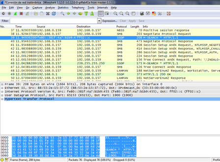
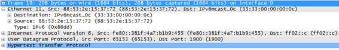
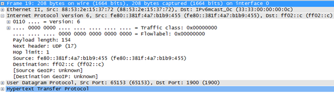
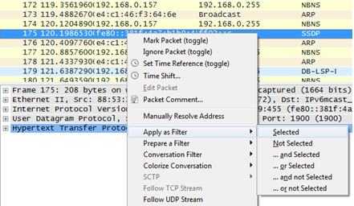
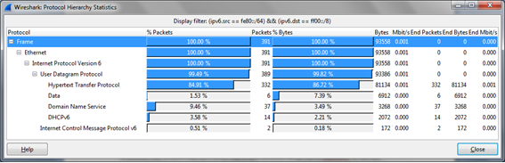
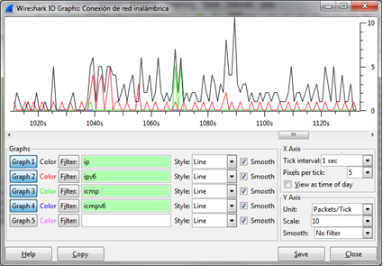

# 1.5 Wireshark 的介绍

> **Wireshark 是什么？**
>
> 图1.9. Wireshark 的 logo
>
> **Wireshark** 是一个免费的、开源的报文分析工具，用于对报文轨迹进行嗅探、抓取和分析。
>
> 报文轨迹是网络中某个地方的传输记录，就像对传输在一个特殊电线中的比特流拍了一张快照。报文轨迹记录了每个报文的时间戳，以及由从底层首部到更高层内容组成的报文的比特位。
>
> Wireshark 可以运行在大多数操作系统上，包括 Windows，MAC 和 Linux。它提供了一个图形化的用户接口来显示报文的顺序，以及显示当比特位被解释为协议头和数据时的比特位意义。为了更清楚表达相关意义，报文以颜色编码的方式显示。为了便于你研究分析行为的不同方面，Wireshark 提供了很多方法来过滤和分析报文。Wireshark 被广泛应用于解决网络故障问题。
>
> Wireshark 的一个最通用场景是一个人想去调试解决网络问题或者想看一个网络协议的内部工作。比如，当一个用户打开网页或者设置一个无线传感器网络时，他/她可以通过 Wireshark 看到底发生了什么。Wireshark 也可用于过滤和查找一个已知的报文属性，便于调试。
>
> 更多的信息以及安装指令请访问 [Wireshark官网](https://www.wireshark.org/)。

 图1.10. Wireshark 屏幕截图

当你打开 Wireshark 时，能看到四个主区域，从上到下依次是：菜单、过滤器、已抓取到报文的列表、关于所选择的报文的详细信息（包括十六进制和 ASCII 的完整内容）。到 Wireshark 官网，你可以找到 Wireshark 的用户手册和安全相关的信息。在`文件`菜单下，有 Open 选项（让你打开先前已经抓取了报文的文件和报文的样例文件）。你可以通过官网下载到所有的报文的样例文件并学习研究它。这将有助于你理解 Wireshark 可以抓取什么报文。

抓取区域让你从有效的接口中选取其中一个，它也告诉你哪些是有效的。点击信息信息将告诉你一些关于这个接口通用信息。

在`抓取`菜单下，一个你可以选择需要抓取或多个接口。抓取很多选项允许你自定义在抓取期间显示哪些信息。你可以选择一个滤波器，一个抓取文件，或更多。在`抓取帮助`菜单下，你可以通过阅读知道 Wireshark 是如何抓取的，可以知道在某一平台某一接口上的网络媒介知识。

我们选择一个接口并点击`开始`。可以通过点击工具栏下的红色方框按钮可以停止抓取。如果你想开始一个新的抓取，点击旁边的看起来像鲨鱼的绿色三角形按钮。完成抓取后，你可以点击文件，并选择`保存`、`打开`或者`合并`其它抓取文件。你可以打印它，你可以脱离程序，你可以以多种方式导出采集报文。

你可以找到一个确定的报文，拷贝报，标记（高亮）任何指定的报文或者所有报文。在`编辑`菜单下的一间有趣的事是重置时间值。需要注意，时间是以秒递增的。点击一个报文后，你可以重置它。你可以给一个报文添加注释、配置属性和个人偏好。

当你从抓取的报文列表里选定一个报文时，Wireshark 将根据该报文的协议显示详细的消息，如以太网报文：

图1.11 以太网报文

或者 IPv6 报文（我们可以在之前提及过的域中看到版本、通信类别、流标签、有效程度、写一个头等等）：

图1.12 IPv6 报文

这里有两种对抓取的报文的列表进行过滤的方法：

* 在一个指定的方框内写一个表达式并应用它\(Apply it\)。你可以指定协议类型\(ip,ipv6, icmp, icmpv6\)，协议的域\(ipv6.dst, ipv6.src\)，甚至使用符号与\(&&\)、或\(\|\|\)、非\(\|\)创建更复杂的表达式。

图1.13. Wireshark 过滤器

* 另一个创建滤波器的方法是鼠标右击一个抓取到的报文。此时将出现一个菜单`应用滤波器`，并在其下级菜单有更多的选项。

图1.14. Wireshark 抓取的报文

Wireshark还提供的另一个有用且有趣的功能——你可以看采集到的报文的统计状态。如果我们应用过滤波器，这个统计结果将只显示被过滤的流量。

图1.15. Wireshark统计图

其它有趣的选项：

* 会话列表→ IPv6
* 统计→终端点列表→ IPv6
* 统计→ IO图形化

上面最后一个选项允许使用不同的曲线和不同的流量类型创建一个图形化界面，并将其图形保存：

图1.16 Wireshark 图表

