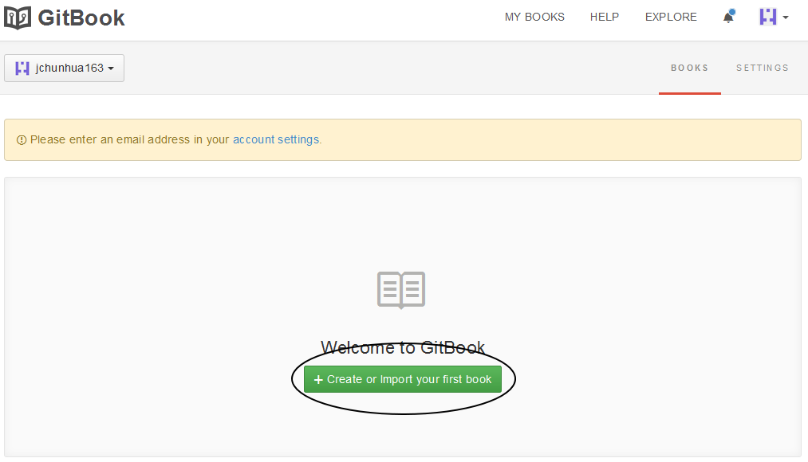
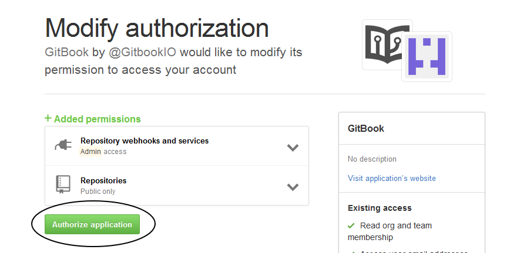
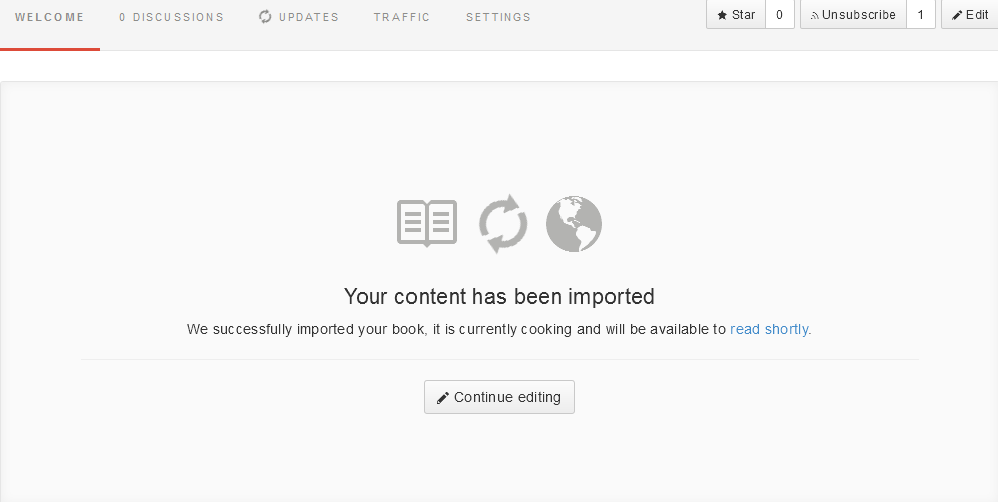
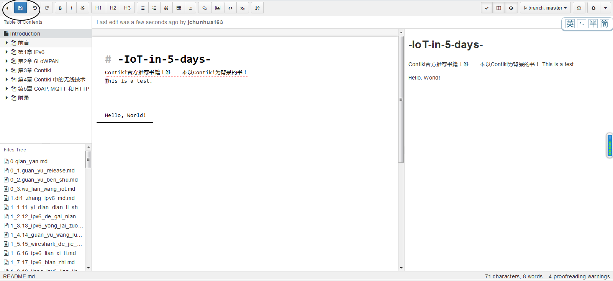
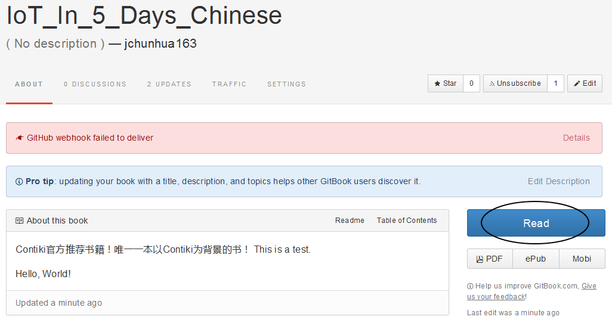
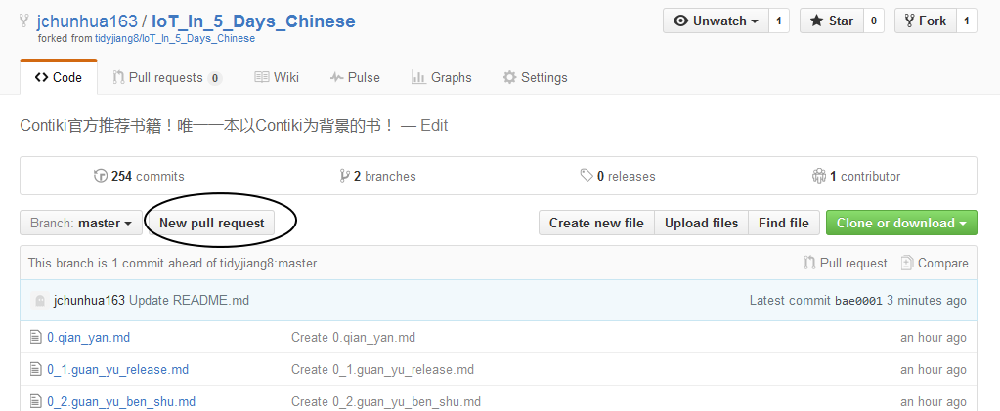

# 贡献代码
可能很多人知道在 Github 如何贡献代码，但是不知道如何在 Gitbook 上贡献代码。所以我专门写了这篇详细的图文教程。

其实思路很简单：将 Gitbook 与 Github 同步。

----------

先登录你的Github，然后找到我托管在 Github 上的项目：
> [https://github.com/tidyjiang8/IoT_In_5_Days_Chinese](https://github.com/tidyjiang8/IoT_In_5_Days_Chinese)

点击右上角的 Fork 按钮

大约等待十秒钟后，系统会将我的仓库fork到你的用户下。进入你的仓库，点击“Clone or download”。在弹出的小窗口中复制你的仓库地址到剪切板。

然后进入 Gitbook 主页，用你的 Github 账户登录 Gitbook。
> https://www.gitbook.com

选择“Authorize Application”。

然后会进入你的 Gitbook 的首页，点击“Import or create new book”。

在下面的选项卡中，选择第三项 “Github”。

此时会再次弹出授权提示，仍然选择“Authorize Application”。

完成授权后，会再次进入你的Gitbook主页。再次点击“Import or create new book” 进入书籍创建页面。依然选择第三项“Github”，然后在下面的下拉列表中选择你克隆的项目，点击“Create Book”创建书籍。

此时 Gitbook 会从你的 Github 仓库创建书籍，骚等一会儿（如果长时间没反应，刷新一下页面）。

书籍终于创建好了！点击右边的“Edit”按钮就可以编辑书籍了（点击 Read 按钮可以在线阅读）。

然后开始编辑吧。

编辑后记得点击保存。

回到书的主页面，点击 Read 按钮，再次确认此次添加的内容是正确的。

回到你的 Github 仓库页面。此时我们可以看到，我们在 Gitbook 编辑的内容已经被同步到 Github 上了。

点击仓库页面上的“Null pull request”按钮。

在弹出的新页面上点击“Create pull request”按钮。

简要说明你修改了什么。然后点击“Create new request”按钮。

然后，我会收到 github 发给我的邮件，通知我有人请求pull request了。

-------------

# 收藏和订阅

最后打个广告

进入我的Github仓库，点击一下右边的 Star 和 watch 按钮。
> [https://github.com/tidyjiang8/IoT_In_5_Days_Chinese](https://github.com/tidyjiang8/IoT_In_5_Days_Chinese)

进入我的Gitbook仓库，点击一下右边的 Star 和 Subscribe 按钮。

> [https://www.gitbook.com/book/tidyjiang8/-iot-in-5-days-chinese/details](https://www.gitbook.com/book/tidyjiang8/-iot-in-5-days-chinese/details "")

